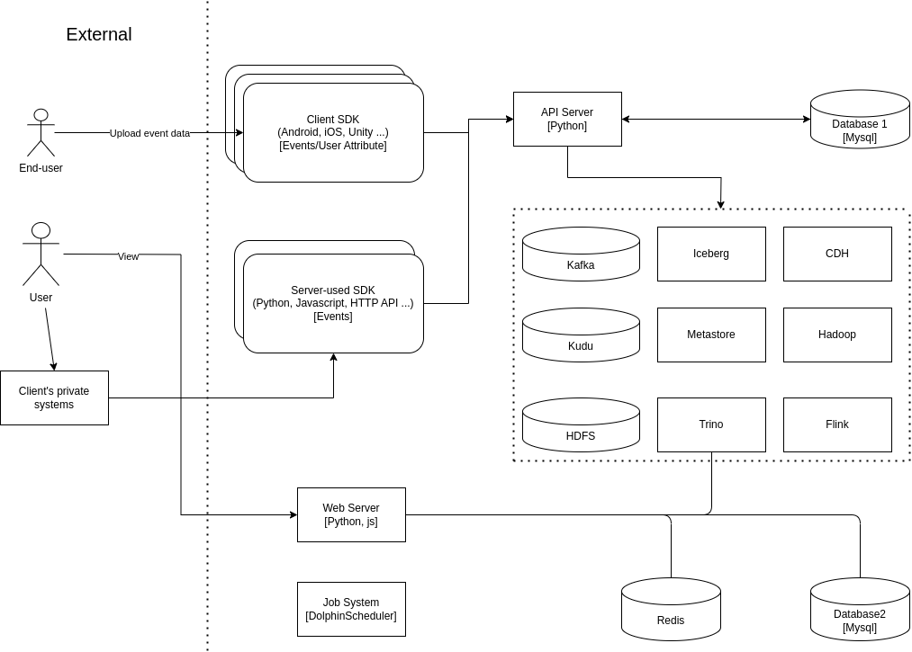

# DTOSP

Datatower open source project

## About

DataTower.ai is an innovative technology company that focuses on leveraging powerful big data analytics platforms and AI technologies to help businesses achieve user and revenue growth in global markets. We offer a comprehensive suite of products including accurate attribution, real-time ROI tracking, user behavior analysis, ad campaign management, and marketing automation. Our goal is to provide data-driven decision-making solutions that enhance companies' capabilities in product optimization, digital marketing, and precision operations.

The Datatower open source initiative includes the parts that we consider mature, stable, and secure. It consists of a system composed of a series of open source software and our proprietary modules, including but not limited to libraries and open source projects such as Java, Python, HDFS, Hadoop, Flink, Sanic, etc. This system allows users to build and operate it on their own.

## Get Started

### Components
* SDKs: Collect data from end-user with various types of clients or directly from third-party servers.
* API server: Gateway of DT system, receiving data from SDKs and third-party.
* BI System: Provide you with visual reports and management dashboard.
    * Frontend
    * Backend
* Jobs and Schedules: ETL and runnable scheduled task programs.
* BigData Extension: Underlying architecture of big data and scalability features.

### Try SaaS

Trying out Datatower is a straightforward process.
Just visit https://datatower.ai/ and follow the instructions step by step.
You can connect your data and get insights within 10 minutes.

### Contribute Guide

## Documentation

For full documentations, please visit our websites:
[Datatower.ai Home Page](https://datatower.ai/)

To contact us or chat with other users, please visit:
[Discord Community](https://discord.gg/bRVZ64EVVV)

## Plugin

## Roadmap

Core

Plugin

SDK

## Contribute

## License
