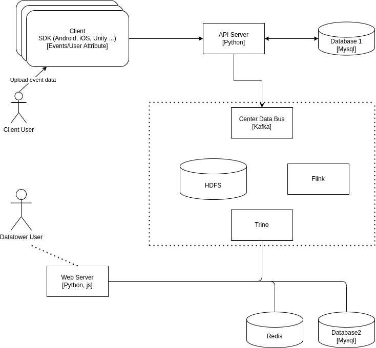

# DOSP
DataTower.ai is an innovative technology company that focuses on leveraging powerful big data analytics platforms and AI technologies to help businesses achieve user and revenue growth in global markets. We offer a comprehensive suite of products including accurate attribution, real-time ROI tracking, user behavior analysis, ad campaign management, and marketing automation. Our goal is to provide data-driven decision-making solutions that enhance companies' capabilities in product optimization, digital marketing, and precision operations.

The Datatower open source initiative includes the parts that we consider mature, stable, and secure. It consists of a system composed of a series of open source software and our proprietary modules, including but not limited to libraries and open source projects such as Java, Python, HDFS, Hadoop, Flink, Sanic, etc. This system allows users to build and operate it on their own.

## Get Started

### Components
* API server
* BI System
    * Frontend
    * Backend
* Bigdata

### Try SaaS

### Run locally

## Documentation
 [Link: Datatower.ai Home Page](https://datatower.ai/)
 <a href="https://datatower.ai/">link</a>

 [Link: Discord Community](https://discord.gg/bRVZ64EVVV)

## Plugin

## Roadmap

Core
Plugin

## Contribute

## License
